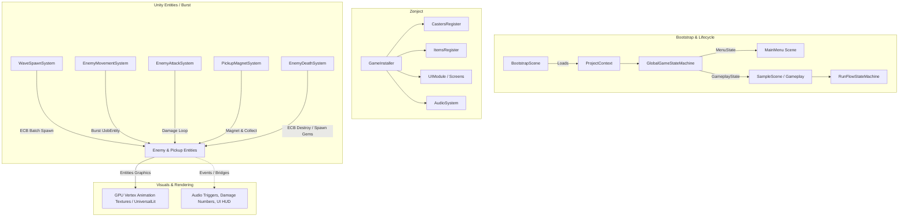

# sorcery-strife

[](https://unity.com/)
[](https://unity.com/dots)
[](#dependency-injection-zenject)
[](#asynchronous-flow--services)
[](https://unity.com/srp/universal-render-pipeline)

A top-down arena survival game featuring auto-cast spell mechanics, horde simulation, and deep item progression. Built on Unity 6 with a hybrid DOTS/ECS architecture designed to simulate and render thousands of concurrent enemies smoothly.

---

## 🎮 Game Design Document (GDD Overview)

### Core Loop
1. **Arena Combat**: The player maneuvers across an open arena avoiding incoming enemy swarms.
2. **Auto-Casting**: Active spells cast automatically on cooldown, targeting nearby threats or creating protective zones.
3. **Experience & Leveling**: Defeated enemies drop experience gems magnetized to the player. Collecting gems fills the experience gauge and triggers level-up choices.
4. **Build Crafting**: Interstitial upgrade screens allow choosing between new spell unlocks, spell rank upgrades, or passive stat-modifying items.
5. **Chests & Loot**: Rare enemy defeats spawn chests containing instant item reward selections.
6. **Wave Progression**: Survive a series of hand-authored, escalating horde waves to achieve victory.

### Spells (Active Abilities)
Spells rank up from Level 1 to Level 5, gaining damage, cooldown reductions, projectile count bonuses, and increased area of effect:

| Spell | Description | Target / Mechanic |
|---|---|---|
| **FireBall** | Fires explosive fire projectiles. | Targets closest enemy; area impact damage on hit. |
| **IceArrow** | High-velocity piercing frost bolt. | Targets closest threat; high single-target burst. |
| **Meteor** | Calls down a massive meteor from the sky. | Targets random enemy cluster; large AOE blast. |
| **MagicField** | Persistent arcane energy field surrounding player. | Continuous damage aura with physical knockback. |
| **HealthRegeneration** | Passive life renewal pulse. | Periodic flat health recovery tick. |
| **ItemDrop** | Arcane fortune enchantment. | Chance to spawn reward chests on enemy defeat. |

### Items (Passive Stat Buffs)
Items utilize an explicit `StatType` and `ModifierOp` (Additive Percent / Flat) system without reflection:

| Item | Primary Stat | Effect |
|---|---|---|
| **Sword of Power** | `Damage` | Increases damage of all spells (+10% per level). |
| **Ring of Arcane** | `Cooldown` | Decreases cooldown of all spells (-10% per level). |
| **Lens of Gods** | `Radius` | Expands area of effect radius for spells (+10% per level). |
| **Wand of Multicast** | `ProjectileCount` | Adds additional projectile instances to projectile spells. |

### Enemies & Waves
- **Melee Swarm**: `Minion`, `Mutant`, `Ogr`, `OldMutant` — swarming enemies with scaling health and contact damage.
- **Ranged Artillery**: `Devil`, `HotDevil`, `Eye`, `BigEye` — evasive units firing projectile attacks toward the player.
- **Finite Wave Scripting**: Configured wave data spawns staged groups with wave timers, escalating into horde encounters with thousands of active combatants.

---

## 🏗️ Architecture & Technical Stack

### High-Level Architecture Diagram



### 1. Hybrid DOTS/ECS Simulation
- **Unity Entities (1.3+) & Burst Compiler**: High-density simulation logic (movement steering, collision checks, attack cooldowns, pickup attraction) executes across worker threads in parallel.
- **Asynchronous Movement**: `EnemyMovementSystem` schedules `SteerTowardPlayerJob` via `.ScheduleParallel(state.Dependency)` without main-thread blocking stalls.
- **Entity Command Buffer (ECB)**: Spawning and destruction are recorded into structural buffers (`BeginSimulationEntityCommandBufferSystem`) and played back at predictable frame boundaries.
- **GPU Vertex Animation Textures (VAT)**: Eliminates CPU skinned mesh animation overhead. Swarms of enemies animate directly on the GPU using `VAT_UniversalLit.shader` and baked position/normal textures.

### 2. Dependency Injection (Zenject)
- **Multi-Scene Boot Chain**:
  - `BootstrapScene` (Build Index 0) resolves `ProjectContext` lazily, sets `DontDestroyOnLoad`, and transitions cleanly to `MainMenu`.
  - `ProjectContextInstaller` binds project-wide singletons (`GlobalGameStateMachine`, `AudioSystem`).
  - `GameInstaller` wires gameplay dependencies (`Player`, `CastersRegister`, `ItemsRegister`, `RunFlowStateMachine`).
- **Constructor Injection**: Pure C# services use standard constructor injection; MonoBehaviours use `[Inject] Construct()` lifecycle methods.

### 3. State Machines
- **`GlobalGameStateMachine`**: Governs scene transitions (`MenuState`, `GameplayState`) routed through `ISceneLoaderService`.
- **`RunFlowStateMachine`**: Manages runtime flow during a combat run:
  - `RunPrepareState`: Run initialization (`Time.timeScale = 1`).
  - `WaveState`: Active combat simulation.
  - `LevelUpInterstitialState`: Pauses simulation for card selections (`Time.timeScale = 0.01`).
  - `RunOverState`: Coordinates player defeat, animation delays, and menu return.

### 4. Audio & UI Architecture
- **AudioSystem**: Pooled sound effects (`SfxAudioSourcePool`), looping sound registry (`LoopingSfxChannel`), and music crossfading.
- **UIModule**: Screen stack management (`BaseScreenManager`, `BaseScreen`) with input rebinding support.
- **StatDisplayFormatter**: Shared zero-allocation `StringBuilder` formatter for card upgrade stats with color-coded "Current → Next" difference highlighting.

---

## 📁 Project Directory Layout

```text
Assets/
├── _Lumenwake/                # Reusable architecture & engine modules
│   ├── Art/                   # Shared UI art, icons, textures
│   ├── Resources/             # Global editor & folder configurations
│   ├── Scripts/
│   │   ├── Editor/            # Custom code generators & toolbars
│   │   ├── Global/            # LoggingSystem, Result<T>
│   │   └── Runtime/           # AudioSystem, SceneLoader, StateMachine, UIModule
│   └── Shaders/               # Interpolation and UI shaders
│
├── _Project/                  # Game-specific assets and logic
│   ├── Animations/            # Player controller & clip overrides
│   ├── Configurations/        # Spells, Items, Enemy stats ScriptableObjects
│   ├── Fonts/                 # TextMeshPro SDF font assets
│   ├── Materials/             # Arena & VFX materials
│   ├── Prefabs/               # Player, UI HUD, Spawners, Projectiles
│   ├── Resources/             # ProjectContext prefab, VAT animation configs & textures
│   ├── Scenes/                # BootstrapScene, MainMenu, SampleScene
│   ├── Scripts/Game/Runtime/  # Entities (ECS), Mechanics (Casting, Combat, Flow), UI
│   ├── Settings/              # URP Asset Profiles (Balanced, High, Performant)
│   └── Shaders/               # VAT_UniversalLit shader
```

---

## 🚀 Getting Started

### Prerequisites
- **Unity Editor**: `6000.3.10f1` (Unity 6 LTS).
- **Target Platform**: PC / Mac / Linux Standalone (Windows DirectX 11/12, Vulkan, or Metal).

### Running in Editor
1. Open the project in Unity `6000.3.10f1`.
2. Open `Assets/_Project/Scenes/BootstrapScene.unity`.
3. Press **Play**. The bootstrap loader will initialize DI containers and load into `MainMenu`.
4. Click **Start** to enter the arena!

### Controls
- **WASD / Arrow Keys**: Move player character.
- **Mouse / UI**: Navigate upgrade and item selection screens.
